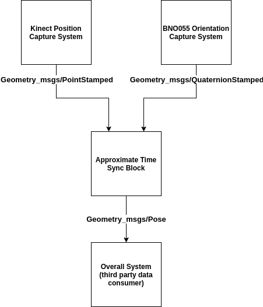
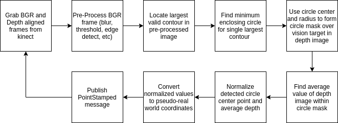
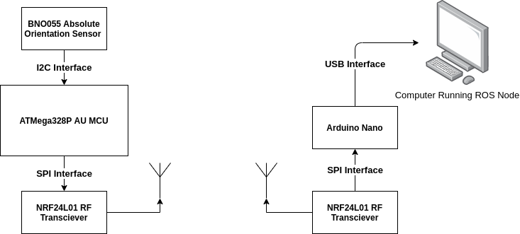
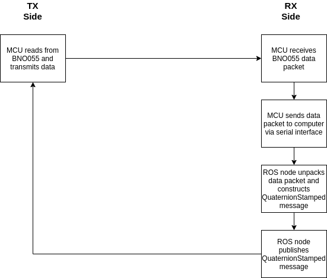

# Kinect-BNO055-Pose-Estimation
This repository contains required software to construct a Pose of a vision target by fusing its x,y,z coordinates from the kinect, with its quaternion orientation from the BNO055 sensor.

## System Description
As mentioned, this system seeks to capture the position (x,y,z coordinates) of a vision target using a Kinect, while capturing it's orientation as a quaternion using a BNO055 sensor. These two data streams are combined into a 6-DOF pose using an approximate time synchornization technique. This system has a multitude of uses in the problem domain of human-robot interaction. Some of these applications include the generation of end-effector goal poses for a "mimic-me" teleoperation robot arm, or potentially the generation of entire arm trajectories for a robot arm to follow. Please have a look at the high-level system block diagram below.



### Kinect Position Capture
The kinect position capture sub-system attempts to locate the vision target in a given RGB frame, and then attempts to extract the vision target's approximate depth and X,Y coordinates in the camera's coordinate frame. From here, these values are scaled and shifted accordingly and re-published to the rest of the system as a PointStamped message. Have a look at this sub-system's block diagram and a physical representation of the system components below. 



### BNO055 Orientation Capture
The BNO055 orientation capture sub-system attempts to determine the orientation of the vision target as a quaternion, and then wirelessly transmit said quaternion back to a base-station MCU. The base-station MCU then sends the quaternion to a ROS node running on a local computer via a serial interface. This ROS node processes the quaternion components and publishes it as a quaternionStamped message to the rest of the system. All designs (mechanical, electrical and firmware) needed to construct the wirless orientation capture sub-system can be found [here](https://github.com/sherrardTr4129/Kinect-BNO055-Pose-Estimation/tree/main/orientation_capture_subsystem_hardware_and_firmware). The overall sub-system block diagram, functional flowchart diagram, as well as a visual representation of the system can be seen in the figures below.







## System Dependencies
The various dependencies of the system can be seen in the following sub-sections.

### Kinect Dependencies
To run the kinect interfacing software in this repository, make sure to install the libfreenect library and python wrappers. Two bash scripts can be found [here](https://github.com/alwynmathew/libfreenect-with-python) that do exactly that.)

### MCU Serial Interface Dependencies
The wirelss orientation data reciever MCU serial ROS driver depends on the pyserial library for serial connectiviy. This library can be installed by running the following command in a terminal:

```bash
sudo apt install python-serial
```

## Usage
This repository contains three distinct ROS packages that are described in more detail below. 


To launch both the kinect position capture node, BNO055 serial ROS driver, and sensor data stream fusion node, run the following in a terminal:
```bash
roslaunch kinect_bno_fusion kinect_bno_fusion_bringup.launch
```

Once these nodes are up and running successfully, you can launch the gazebo visualization tool by running the following in a terminal:
```bash
roslaunch gazebo_pose_example kinect_set_pose_demo.launch
```
This will launch a Gazebo instance, in which a cube will be instantiated that will have it's Pose set by the Pose generated from the sensor data fusion node that was launched in the last step.
